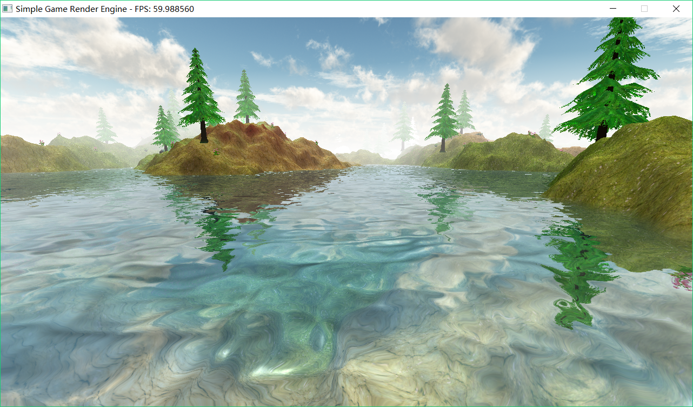
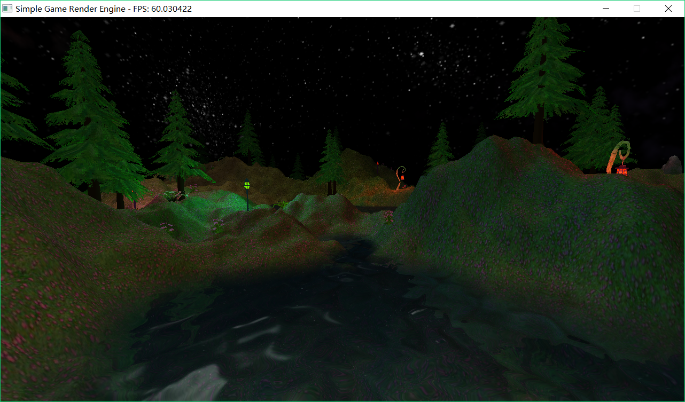
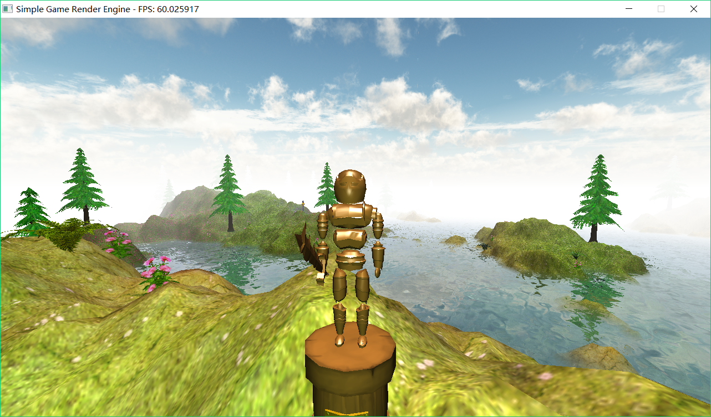

# Simple Game Render Engine
This is a simple game render engine based on OpenGL written in C++. It is based on the [tutorial series by ThinMatrix](https://www.youtube.com/playlist?list=PLRIWtICgwaX0u7Rf9zkZhLoLuZVfUksDP) on youtube.

## Screenshot






## Progress
1. [x] Basic display (Tutorial 1 ~ 8)
2. [x] Obj file (Tutorial 9 ~ 10)
3. [x] Basic lighting (Tutorial 11 ~ 12)
4. [x] Basic optimizing (Tutorial 13)
5. [x] Basic multitextured terrain with height map (Tutorial 14, 17 and 21)
6. [x] Basic transparency (Tutorial 15)
7. [x] Fog (Tutorial 16)
8. [x] Basic camera movement
9. [ ] Player and 3rd person camera (Tutorial 18 ~ 19)
10. [x] Mipmapping (Tutorial 20)
11. [x] Terrain collision detection (Tutorial 22)
12. [x] Texture atlases (Tutorial 23)
13. [ ] GUI (Tutorial 24)
14. [x] Multiple lights (Tutorial 25)
15. [x] Point lights (Tutorial 26)
16. [x] Skybox (Tutoral 27)
17. [x] Day and night (Tutorial 28)
18. [x] Water effect ([Water tutorial](https://www.youtube.com/playlist?list=PLRIWtICgwaX23jiqVByUs0bqhnalNTNZh) 1 ~ 8)
19. [ ] Normal mapping (Tutorial 31)
20. [ ] Text rendering (Tutorial 32 ~ 33)
21. [ ] Particle effects (Tutorial 34 ~ 36)
22. [ ] Shadow mapping (Tutorial 38 ~ 40)
23. [ ] Antialiasing and anisotropic (Tutorial 41)
24. [ ] Post-processing effects (Tutorial 43 ~ 44)
25. [ ] Specular maps (Tutorial 46)
26. [ ] Bloom effect (Tutorial 47)
27. [ ] Cube map reflections (Tutorial 51 ~ 52)
28. [ ] Lens flare (Tutorial 53)

## Build and Run
If you want to build this project from source code, you will need the following libraries:
- glew
- glfw

You will also need a "res" folder to provide the executable file with the resources it needs. You can download the "res" zipped file [here\(DropBox\)](https://www.dropbox.com/s/3wnedakeeb4ddec/res.zip?dl=0) or [here\(Baidu Netdisk\)](http://pan.baidu.com/s/1o8sWhSm) (Please note that all the resources in the "res" folder belong to their original author, aka ThinMatrix).

After downloading, decompress "res.zip" and put the "res" folder in the project root folder, so that the file structure looks like this:
```
- src
   |- render
   |- logic
   |- ...
- res
   |- cube
   |- entity
   |- ...
- ...
```

After solving the dependency problems, just go into the project root folder, and run `make` in the terminal. An executable file "main.exe" will be generated. It is recommended to use a GPU to run this project for better performance.

As I'm using Windows, I can only provide a Windows Makefile. If you are interested, please feel free to add a Linux or Mac Makefile.
